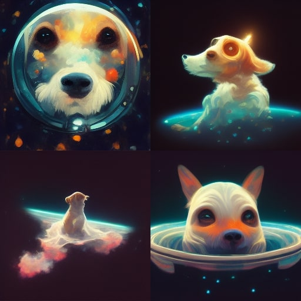

# Misión  
Brindar productos innovadores y de alta calidad para el bienestar y disfrute de las mascotas, creando accesorios prácticos, cómodos y con estilo, que fortalezcan el vínculo entre los dueños y sus animales, mientras fomentamos una cultura de cuidado y respeto por los seres vivos.  

# Visión  
Ser la marca líder en el mercado de accesorios para mascotas, reconocida por su diseño único, funcionalidad y compromiso con el bienestar animal. Expandir nuestra presencia a nivel nacional e internacional, y contribuir a la creación de productos que mejoren la calidad de vida de las mascotas y sus dueños.  

# Público Objetivo  
Dueños de mascotas (perros, gatos y otros pequeños animales), que buscan productos funcionales y de calidad para mejorar la comodidad y el bienestar de sus animales. Este público incluye tanto a familias como a personas solteras, de diversas edades y estratos socioeconómicos, especialmente aquellos que valoran la innovación, el diseño y la calidad de los productos que adquieren para sus mascotas.  

Perro-flotando-en-espacio-4-resultados.jpg

## Dejando Huellas Mascotas  
**"Dejando Huellas Mascotas"** ofrece

